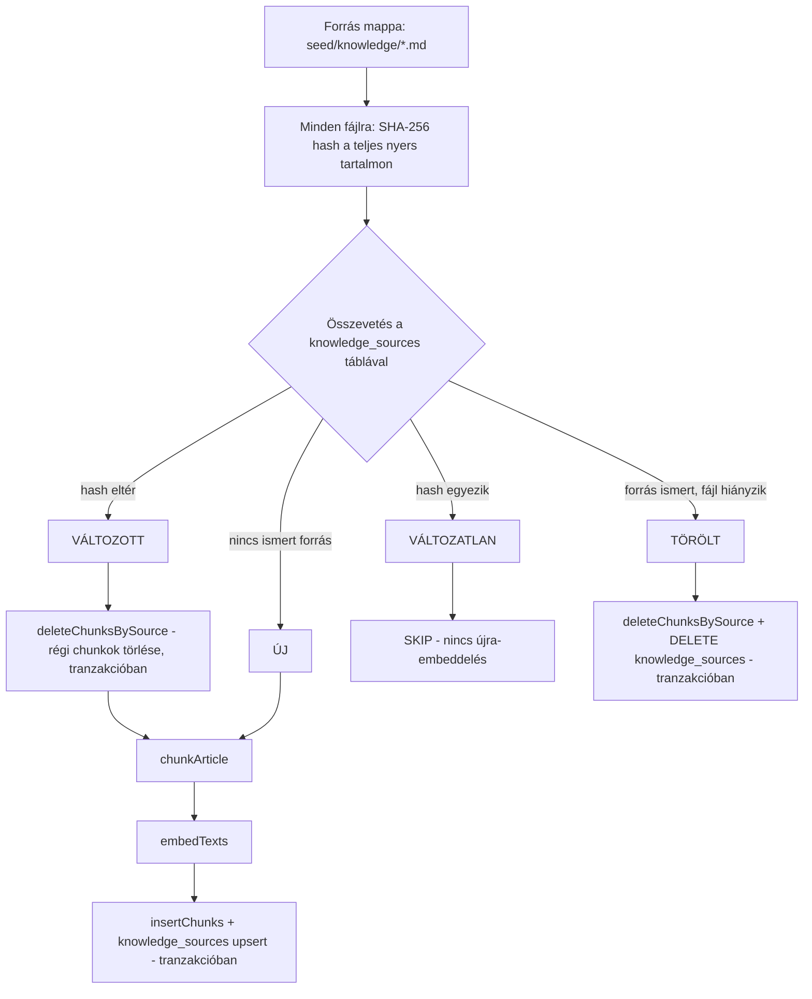

# Plantbase — RAG karbantartási architektúra (F8)

> A HF3 (F rész, `docs/implementation/05-rag-pipeline.md`) által megkövetelt karbantartási
> architektúra-terv: hogyan kezelnénk a tudásbázis (202 gondozási cikk) új/módosított/törölt
> forrásait, és — a HF3 saját, névvel nevezett elvárása szerint — hogyan kerülnénk el a
> **változatlan** dokumentumok felesleges újra-vektorizálását. **Ez a dokumentum tisztán terv, nem
> kód** — a benne leírt `KnowledgeSource` tábla és sync-logika NEM létezik a jelenlegi kódban
> (F1–F8 — ez a dokumentum, F8, maga sem implementál kódot, csak megtervezi), ld. "Kimarad" lent.

## A jelenlegi állapot és a hiányzó rész

Az `ingest.ts` (F5) ma **mindig teljes wipe+reload**-ot végez: `clearKnowledge()` (a teljes
`knowledge_chunks` tábla ürítése), majd mind a 202 cikk újra-chunkolása és -embeddelése,
**változástól függetlenül**. Ez a HF3 által explicit kifogásolt viselkedés: egy változatlan cikket
is újra embeddelünk minden ingest-futtatásnál, ami felesleges OpenAI-API-költség. Ez a dokumentum
azt a hash-alapú sync-mechanizmust tervezi meg, ami ezt kiváltaná — **de ennek tényleges
implementálása nem F8 része**, csak a terv.

## `KnowledgeSource` — tervezett tábla

```prisma
model KnowledgeSource {
  id              Int      @id @default(autoincrement())
  source          String   @unique             // pl. "care-miscellaneous__why-plant-leaves-turn-yellow.md"
  title           String
  category        String
  contentHash     String                       // SHA-256 hex a TELJES nyers fájltartalmon (frontmatterrel együtt)
  chunkCount      Int                          // hány chunk jött ki belőle a legutóbbi indexeléskor
  embeddingModel  String                       // az EMBEDDING_MODEL konstansból, automatikusan az ingest-futáskor
  chunkingVersion Int                          // manuálisan növelt szám, ha a chunk.ts logikája/konstansai változnak
  createdAt       DateTime @default(now())     // mikor jelent meg először
  lastIndexedAt   DateTime @updatedAt          // mikor indexeltük utoljára (tartalom- vagy pipeline-változás miatt)

  @@map("knowledge_sources")
}
```

Az `id Int @id @default(autoincrement())` + `source String @unique` mintát követi (nem a
`source` a PK) — ugyanaz a konvenció, mint a `Product`-nál (`latin_name String @unique`) és a
`KnowledgeChunk`-nál (`id Int @id @default(autoincrement())`) a `schema.prisma`-ban, hogy a
tábla stílusban konzisztens maradjon a meglévőkkel.

A `knowledge_chunks.source` mező (már létezik, F2) logikailag erre a táblára hivatkozna. Ha ez a
terv implementálódik, egy `ON DELETE CASCADE` FK-kényszer (`knowledge_chunks.source →
knowledge_sources.source`, a `@unique` mezőre hivatkozva, nem szükséges hozzá `@id`) automatikusan
törölné egy forrás chunkjait a forrás törlésekor, csökkentve az "elfelejtett kézi DELETE"
hibalehetőséget.

**RO/RW-hozzáférés**: a `knowledge_sources` tábla kizárólag az ingest/sync-script RW-poolján
(`getWritePool()`) íródna/olvasódna — az agent (`searchKnowledge`) sosem érné el, nincs rá
szüksége. Emiatt, ellentétben a `knowledge_chunks`-szal, ennek a táblának **nem** kellene RO
`SELECT`-jogot adni a `db-role-setup` skillben, ha ez a terv implementálódik.

**Hiányzó függvény, ha implementálódik**: a `knowledge-store.ts` jelenleg csak `insertChunks`,
`searchChunks` és `clearKnowledge` (a TELJES tábla ürítése) függvényeket ismer — egyik sem alkalmas
egyetlen forrás chunkjainak szelektív törlésére. A sync-algoritmushoz egy új
`deleteChunksBySource(source: string): Promise<void>` függvény kellene (`DELETE FROM
knowledge_chunks WHERE source = $1`, a RW poolon), amit a VÁLTOZOTT és TÖRÖLT ágak egyaránt
használnának.

### Miért a teljes fájlon fut a hash, nem csak a body-n

A `chunk.ts` a cikk `title`-jét belesüti minden chunk `content`-jébe kontextus-prefixként (F4, 3. döntés) — tehát ha **csak** a frontmatter `title`-je változik (a body nem), az embeddelt szöveg
mégis megváltozik minden abból a cikkből származó chunknál. Ha a hash csak a body-n futna, ez a
változás észrevétlen maradna. A teljes nyers fájltartalom (frontmatter + body) hash-elése ezt az
esetet automatikusan helyesen kezeli.

### Miért `chunkingVersion` manuális szám, nem automatikusan számolt konfig-hash

Egy automatikusan számolt hash (pl. a `MAX_CHUNK_TOKENS`/`OVERLAP_SENTENCES` konstansokból) csak a
**számok** változását venné észre — egy **algoritmus-változást** (pl. a `splitByH2` regexének
módosítását) nem. A manuálisan növelt verziószám bármilyen "megváltozott a chunkolás viselkedése"
esetet lefed, cserébe fejlesztői fegyelmet igényel: ha ez a terv implementálódik, a `chunk.ts`
kapna egy saját `export const CHUNKING_VERSION = 1;` konstanst, és **szabály**, hogy minden, a
chunkolás viselkedését érdemben módosító változtatás növeli ezt.

### Denormalizáció-figyelmeztetés

A `chunkCount` egy származtatott, cache-jellegű érték — csak a sync-scriptet (nem kézi
DB-módosítást) használva marad pontos.

## Sync-algoritmus

### Per-fájl ágak (a napi/gyakori eset)

```
forrásfájlok = readdir(seed/knowledge/*.md), mindegyikhez computeHash(nyers fájltartalom)
tároltForrások = SELECT source, contentHash FROM knowledge_sources

ÚJ         — forrásfájlokban van, tároltForrások-ban nincs
             → chunkArticle + embedTexts + insertChunks + INSERT INTO knowledge_sources
VÁLTOZOTT  — mindkettőben van, de a hash eltér
             → [TRANZAKCIÓ: deleteChunksBySource(source) →
                chunkArticle + embedTexts + insertChunks (újra) →
                UPDATE knowledge_sources SET contentHash=?, chunkCount=?, embeddingModel=?,
                chunkingVersion=?, lastIndexedAt=now() WHERE source=?]
VÁLTOZATLAN — mindkettőben van, hash egyezik
             → SKIP, nincs újra-embeddelés (ez a HF3 explicit elvárása)
TÖRÖLT     — tároltForrások-ban van, forrásfájlokban nincs
             → [TRANZAKCIÓ: deleteChunksBySource(source) →
                DELETE FROM knowledge_sources WHERE source=?]
             (ON DELETE CASCADE esetén a deleteChunksBySource hívás elhagyható lenne, a
             DELETE FROM knowledge_sources automatikusan kaszkádolna a chunkokra)
```

Minden `deleteChunksBySource` + `insertChunks` + `knowledge_sources` upsert lépéssorozat **egy
tranzakcióban** fut (ÚJ-nál a delete lépés nélkül, de az `insertChunks` + `knowledge_sources`
INSERT párja ugyanígy egy tranzakció) — ha a sync script félbeszakadna (crash) a törlés és az
újra-beszúrás között, tranzakció nélkül a tudásbázis inkonzisztens állapotban maradna (hiányzó
chunkok egy forráshoz, vagy egy `knowledge_sources` sor, aminek a hash-e nem egyezik a ténylegesen
tárolt tartalommal).

**Fontos implementációs korlát**: ez a tranzakció-garancia **nem** adott automatikusan a jelenlegi
kóddal. A `knowledge-store.ts` meglévő függvényei (`insertChunks`, `searchChunks`,
`clearKnowledge`) mindegyike önállóan hívja a `getWritePool().query(...)`-t — egy `pg.Pool`
`.query()` hívásai különböző kapcsolatokat is kaphatnak, nincs köztük megosztott tranzakciós
kontextus. Ha ez a terv implementálódik, a `deleteChunksBySource`/`insertChunks`/`knowledge_sources`-upsert
lépéseknek egy közösen kicsatolt `pg.PoolClient`-et kellene elfogadniuk (`pool.connect()` → `BEGIN`
→ lépések a client-en → `COMMIT`/`ROLLBACK` hiba esetén → `release()`), nem Prisma
`$transaction`-nal. Ennek két oka van: (1) architekturális elv — a RAG-alrendszer tudatosan Prisma
nélkül, nyers `pg`-vel megy (`docs/architektura.md`, 2. döntés); (2) technikai kényszer — a
`schema.prisma`-ban az `embedding` oszlop `Unsupported("vector(1536)")`, amit a Prisma Client
eleve nem tud típusosan lekérdezni/írni, tehát bármi, ami az embeddinget érinti, Prisma mellett is
nyers SQL-re (`$queryRaw`/`$executeRaw`) szorulna — a jelenlegi, közvetlen `pg`-használat emiatt
amúgy sem kerülhető el, nem csak preferencia kérdése.

### Globális ág: pipeline-verzió-migráció (ritka esemény, nem per-fájl)

Ha a jelenlegi kódban lévő `EMBEDDING_MODEL` vagy `CHUNKING_VERSION` **eltér** bármelyik
`knowledge_sources` sor tárolt `embeddingModel`/`chunkingVersion` értékétől, az nem egy adott
forrás tartalmi változása, hanem egy **globális pipeline-migráció** jelzése — ilyenkor a teljes
korpuszt "VÁLTOZOTT"-ként kell kezelni, a `contentHash`-tól függetlenül (mert az embedding-vektorok
egy más vektortérből származnának, vagy a chunk-határok másképp esnének, mint a frissen
indexelteké). Ez a per-fájl sync-ciklustól elkülönített, ritka, tudatos esemény (pl. modellváltás
döntése után futtatva), nem egy automatikusan minden ingest-futásnál lefutó ág.

## Ábra — az adatfolyam (per-fájl ágak)



Renderelt, statikus export (a HF3 szó szerinti "screenshot/export a repóba" mellékletéhez):
[`docs/rag-architektura.assets/adatfolyam.png`](rag-architektura.assets/adatfolyam.png).

## Kimarad (tudatosan, F8-ban NEM)

- **Tényleges kód** — a `KnowledgeSource` Prisma-modell, a sync-script, a `CHUNKING_VERSION`
  konstans: mind terv szinten maradnak. Ha egyszer implementálódnak, akkor a `docs/ddd/model.md`-t
  is bővíteni kell a `KnowledgeSource` entitással (`ddd-audit` szabály) — ez most még nem
  esedékes, mert a tábla nem létezik.
- **Konkurrens sync-futások elleni védelem** (pl. advisory lock) — a projekt jelenlegi
  használati mintája (egy fejlesztő, kézzel indított script) mellett nem indokolt.
- **Automatikus/ütemezett újraindexelés** (cron, CI) — a trigger terv szinten is manuális marad,
  ahogy a jelenlegi `ingest.ts` is az.
- **Forrás-átnevezés felismerése** (hash-egyezés más fájlnév alatt = rename, nem törlés+új) — a
  jelen tervben egy átnevezés TÖRÖLT+ÚJ párként kezelődne (felesleges, de nem hibás
  újra-embeddelés) — elfogadott egyszerűsítés, mivel a vendorolt cikkek (F3) ritkán nevezik át.
- **Az `ingest.ts` jövőbeli sorsa nyitott kérdés** — ez a terv nem dönti el, hogy a sync-script
  teljesen leváltaná-e a jelenlegi teljes-wipe `ingest.ts`-t, vagy az megmaradna egy külön,
  tudatosan választható "teljes újraépítés" módként (pl. egy flaggel) a sync mellett —
  implementáció-részlet, nem architektúra-döntés.
